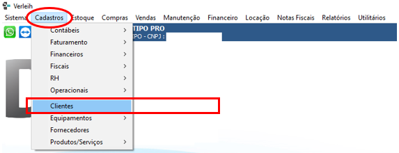
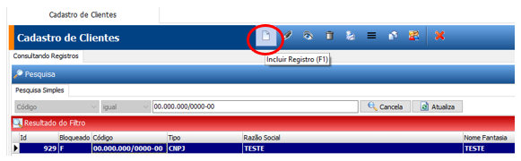
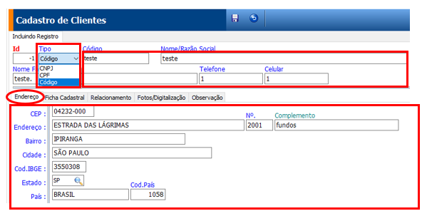
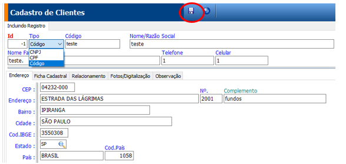
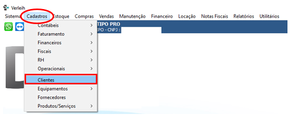
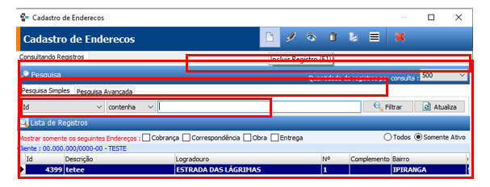
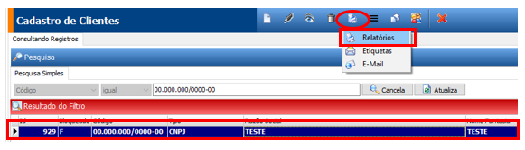
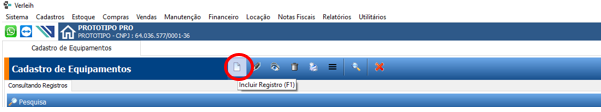

# Clientes

\

##

O item ou personagem mais importante da sua e da nossa empresa, destinatário de grande parte dos nossos: esforço, energia e dedicação.

\

***

## Como Incluir Clientes

*   Passo 1:

    Ir em “Cadastro” – “Clientes”.

    <figure><figcaption></figcaption></figure>
*   Passo 2:

    1 - Clique no botão “folha em branco” – para incluir registro.

    <figure><figcaption></figcaption></figure>
*   Passo 3: Escolha o Tipo:

    * CNPJ – para cadastro de Pessoa Jurídica;\

    * CPF – para cadastro de Pessoa Física;\

    * Código – para os casos que não tenha CNPJ ou CPF, como empresas ou pessoas físicas estabelecidas / domiciliadas no exterior.\
      \

    (\*) Quando o código for **CNPJ** aparecerá o símbolo da Receita Federal ! para busca das informações do cadastro do CNPJ.
*

    <figure><figcaption></figcaption></figure>

    \

    1 – Campo Código - preencher as informações do tipo escolhido;\
    2 – Campo Nome/Razão Social - complete com a razão social ou nome do cliente;\
    3 – Campo Nome Fantasia – preencher com o nome fantasia ou apelido;\
    4 – Campo Telefone – indicação do telefone fixo;\
    5 – Campo Celular - indicação do telefone celular.
*   Passo 4:

    Endereço:\
    1 – Buscando as informações do CNPJ será preenchido automaticamente;\
    2 – Campo CEP – indique o número do CEP e os dados serão preenchidos com as informações da página do Correios. Complete se o CEP não for da rua e sim da cidade;
* Passo 5:\
  Ficha Cadastral:
  *   1 - Características:\
      Campo Múltiplos IE – “V”para clientes com múltiplos I.E ( Inscrições Estadual) para o mesmo CNPJ

      1. Campo Produtor Rural – “V” quando o cliente tem inscrição produtor Rural;
      2. Campo Contribuinte de ICMS – “V” quando o cliente for contribuinte para envio do número de inscrição estadual para a Nota Eletrônica;
      3. Campo SIMPLES Nacional – indicar se o cliente é do SIMPLES NACIONAL;

      \

  *   2 - Retenções, quando o cliente for obrigado a retenção dos impostos nos casos aplicáveis:

      1. Campo Contribuição Federal - “V” para retenção dos impostos de 4,65% Lei 10.833/2003;
      2. Campo IRF - “V” para retenção de Imposto de Renda Retido na Fonte;
      3. Campo ISS - “V” para retenção de Imposto Sobre Serviços;
      4. Campo INSS - “V” para retenção do INSS sobre faturamento;
      5. Campo PIS / COFINS - “V” para retenção sobre venda mercadorias Lei 10.485/2002;

      \

  *   3 - Demais campos:

      1. Campo “I.E.”- número da inscrição estadual, que faz a conferência se está correto a digitação;
      2. Campo “C.C.M” – número da inscrição municipal;
      3. Campo “R. G.” – número do registro geral de pessoa física;
      4. Campo “Nasc./Constituição – data de constituição ou nascimento para Pessoa física ou jurídica;
      5. Campo Telefone – número do telefone com DDD;
      6. Campo Padrão de Envio de NFE/NFSE – definir qual será o e-mail padrão para o cliente para envio das notas;

      \

* Passo 6: Relacionamento:
  1. Campo Status – informação subjetiva com objetivo de classificar o cliente em, por exemplo: Ótimo, Bom, etc.
  2. Campo “Grupo/Família” – não obrigatório, más com função de compartilhamento de tabela de preço, identificação de importância para o coletivo (Grupo);
  3. Campo “Atividade” – preencher com a atividade principal desenvolvida por seu cliente, gerando informação dos setores da economia que pertencem;
  4. Campo Limite de Crédito – valor da capacidade de pagamento atribuída ao cliente, que é apurado com as duplicatas em aberto mais o valor da Cotação de Venda ou Locação; Obs.: Campo Limite de crédito é importante para o sistema avisar ou bloquear quando ultrapassar este valor.
  5. Campo Desconto – percentagem padrão de desconto para o cliente;
  6. Campo Contrato anual – número do contrato para os casos de contratos globalizados;
  7. Campo Fonte de propaganda – qual a fonte de propaganda que o cliente pesquisou para localizá-lo, com o objetivo de avaliar as despesas com propaganda;
  8. Campo Vendedor – a indicação do responsável pelo atendimento ao cliente que pode ser exclusivo ou não;
  9. Campo Conta contábil – a ser preenchido para as empresas com integração com outros sistemas;
  10. Campo Transportadora preenchido quando for uma transportadora preferencial para este cliente;
*   Passo 7:

    Faturamento:\
    Customização de algumas informações importantes para a boa negociação, quando este cliente tiver condições diferentes do padrão, como:

1. Campo Condição Pagamento – preencher quando diferente do padrão, que será assumida para todas as cotações de Locação ou Venda;
2. Campo “Forma de Pagamento” - preenchido quando diferente do padrão;
3. Campo Periodicidade - preencher quando diferente do padrão;
4. Campo Periodicidade dos acessórios - preenchido quando diferente do padrão;
5. Campo Centro de custo – preencher quando quiser definir um centro de custo para este cliente no faturamento e despesas;
6. Campo “Faturamento Restrito” – quando definido como verdadeiro escolherá os dias que serão permitidos a emissão da Nota de Locação, independentemente de já constar no Controle de Faturamento.

*   Passo 8:

    Fotografia – inclusão de foto do cliente;
*   Passo 9:

    Observação – informação relevante para o bom atendimento do cliente que não tenha o campo específico. Esta informação vai ser oferecida em cada Cotação de Locação ou Venda que fizer.

***

## Como Editar Clientes

*   Passo 1:

    Ir em “Cadastro” – “Clientes”;
*   Passo 2:

    1 - Selecione o cliente que deseja fazer a correção;\
    2 - Clique no botão “Lápis” para a edição.
*   Passo 3:

    1 - Selecione a aba que deseja corrigir;\
    2 – Faça a correção do(s) campo(s) desejados;\
    3 - Clique no botão “Gravar”.

***

## Como Remover Clientes

*   Passo 1:

    Ir em “Cadastro” – “Clientes”.
*   Passo 2:

    1 - Selecione o cliente que deseja remover;\
    2 - Clique no botão “Lixeira”;\
    3 – Clique no botão “Gravar.
*   Passo 3:

    1 - Gravar.

    <figure><figcaption></figcaption></figure>

***

## Como Incluir Endereço De Clientes

*   Passo 1:

    Ir em “Cadastro” – “Clientes”;

    <figure><figcaption></figcaption></figure>
*   Passo 2:

    1 - Selecione o cliente no qual deseja incluir mais endereços;\
    2 - Clique no botão “Duas Folhinhas Brancas” para abertura da tela de cadastro de endereços;
*   Passo 3:

    1 - Clique no botão “Folha Branca” para iniciar o processo;\
    2 - Escolha o tipo de endereço que deseja cadastrar que pode ser um ou mais: End. De Correspondência, End. Entrega, End. Obra, End. Cobrança, para abertura simultânea;\
    3 – No campo “Descrição” – indique o nome do local da obra, que pode ser o nome do edifício, empresa ou qualquer outro;\
    {==Caso o cliente queira que o CEI apareça na nota de locação inclua neste campo;==}\
    4 – Ao concluir as informações clique no botão “Gravar”.

    <figure><figcaption></figcaption></figure>

***

## Como Editar Endereços De Cliente

*   Passo 1:

    Ir Em “cadastro” – “clientes”.

    <figure><figcaption></figcaption></figure>
*   Passo 2:

    1 - Selecione o cliente que deseja editar;\
    2 - Clique no botão “Duas Folhinhas Brancas” para abrir a tela de “Cadastro de Endereços”;
*   Passo 3:

    1 – Escolha o endereço a alterar;\
    2 - Clique no botão “Lápis” para a edição;\
    3 – Faça as alterações desejadas e clique no botão “Gravar

***

## Como Remover Endereços De Cliente

*   Passo 1:

    Ir em “Cadastro” – “Clientes”;

    <figure><figcaption></figcaption></figure>
*   Passo 2:

    1 - Clique no botão “Duas Folhinhas Brancas” para abrir a tela de “Cadastro de Endereços”;\
    2 - Selecione o endereço que deseja remover;\
    3 - Clique no botão “Lixeira”;\
    4 – Confirme a eliminação no botão “Gravar”.

***

## Como Imprimir Relatorios Cliente

*   Passo 1:

    Ir em “Cadastro” – “Clientes”;
*   Passo 2:

    1 - Selecione os clientes a serem impressos com a utilização dos filtros disponíveis;\
    2 - Clique no botão “Impressora” para abrir a tela com as opções dos relatórios;\
    3 – Escolha o relatório desejado;\
    4 – Clique no botão “Impressora”.
