# Equipamentos

## Cadastro de Equipamentos

Observação:

Os equipamentos podem ter dois tipos de controle:

* Individual;
* Quantitativo.

Dividido em: Grupo, Subgrupo e Item, este para os casos de controle individual ou patrimonial.\

* A escolha do tipo de controle entre Individual ou Quantitativo deve ser feita sempre pensando em alguns pontos:
* Individual ou patrimonial - alto custo individual, facilidade de identificação, vida útil longa, avaliação das manutenções, faturamento e resultado;
* Quantitativo – baixo custo individual, dificuldade de identificação, vida útil pequena.

A máscara é definida no Parâmetros / Mascara e Formatos.

## Como Criar Grupo Para Equipamentos

O Grupo de equipamentos é a identificação dos tipos de equipamentos, cabendo a linha ou subgrupo as capacidades e preços diferentes.

*   Passo 1:

    Ir em “Cadastro” – “Equipamentos” – “Equipamentos”;
*   Passo 2:

    1 - Clicar no botão “Folha em Branco” para iniciar o processo;\
    2 – Escolha a classificação do equipamento “Grupo”;\
    3 – Clique no botão “Ok”.
*   Passo 3:

    1 – Inclua no campo “Código” a informação desejada e que não coincida com os já existentes e é prudente manter um padrão, também, deixe uma faixa entre os códigos para inclusão futura;\
    2 – Inclua no campo “Descrição” as informações desejadas;\
    3 - Clique no botão “Gravar”.

    <figure><figcaption></figcaption></figure>

***

## Como Criar Subgrupo ou Linha Para Equipamentos

*   Passo 1:

    1 - Ir em “Cadastro” – “Equipamentos” – “Equipamentos”

    <figure><figcaption></figcaption></figure>
* Passo 2:
  1. Clicar no botão “Folha em Branco” para iniciar o processo;
  2. Escolha a classificação do equipamento “Linha”;
  3. Escolha no campo de “Selecione o Grupo” a qual pertencerá este subgrupo;
  4. O sistema sugerirá como código o próximo número sequencial a partir do último incluso, que pode ser substituído conforme sua vontade;
  5. Campo “Descrição” – que é o nome da linha de produto;
* Passo 3:
  1. **Aba Informações da Linha**
  2. Clique no campo de \[] Quantitativo quando a administração do patrimônio for por quantidade. Exemplos:
     * Equipamentos para construção civil: ponteiros, talhadeiras, painel, etc.;
     * Computadores: cabos de força, mouse, etc;
     * Deixe o campo \[] Quantitativo sem o clique para o controle individual;
  3. Escolha o Tipo entre: 1- Patrimônio – são os equipamentos principais do parque de locação e cedidos, quase sempre, de forma onerosa; 2 – Acessórios – para o equipamento auxiliar ao principal e que são fornecido de forma gratuita;
  4. Campo NCM – indicar o NCM correspondente ao equipamento, que é indispensável para emissões de notas de remessa;
  5. Valor de Mercado – é o valor que constará na nota de remessa e no contrato como base para indenização de sinistro;
  6.  **Aba Informações Faturamento**

      <figure>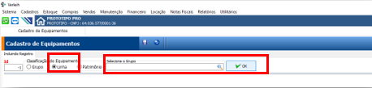<figcaption></figcaption></figure>
  7. Campo “Locação por” – escolher o padrão a ser utilizado para estes equipamentos do tipo de contrato que fazem, que podem ser por: dia, mês, milímetro, etc.;
  8. Campo “Mínimo Faturamento” – quando quiser definir uma quantidade mínima de unidade de faturamento por período;
  9. Campo – “Serviços de Locação” é com este serviços que o sistema entende se a cobrança será com a fatura de locação ou nota fiscal de serviços, considerando o que está definido no cadastro do serviço;
  10. Campo “Periodicidade” – a definição do padrão da periodicidade aplicado para a locação do equipamento, exceto se definida periodicidade diferente para o cliente;
  11. \
      \
      **Aba Inf. Técnicas /Localização**

      <figure>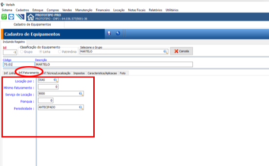<figcaption></figcaption></figure>
  12. Campo “Unidade” – unidade definida pelo estado para emissão de notas fiscais de venda ou remessa;
  13. Campo “Vida Útil” – tempo estimado pelo locador para este tipo de equipamento;
  14. Campos “Rua”, “Prateleiras e “Caixa” – para as empresas que tenham local definido de armazenamento para cada item;
  15. \
      \
      **Aba Impostos**

      <figure>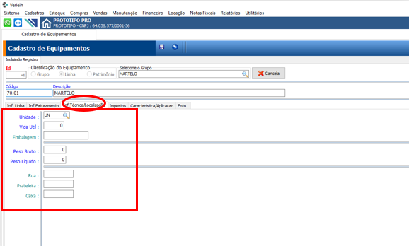<figcaption></figcaption></figure>
  16. São as situações tributárias de ICMS, IPI, PIS e COFINS para emissão das notas de remessa e retorno.
  17. **Aba Características/Aplicações**

      <figure>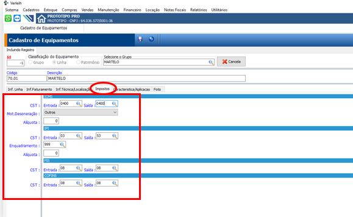<figcaption></figcaption></figure>
  18. Destinada a descrever as características de uso e capacidade como auxílio a vendedor ou usuário do sistema que não tenha tanto conhecimento dos equipamentos
  19.

      <figure>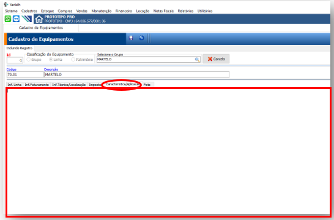<figcaption></figcaption></figure>

***

## Como Criar Um Item Ou Equipamento Individual

*   Passo 1:

    Ir em “Cadastro” – “Equipamentos” – “Equipamentos”;

    <figure><figcaption></figcaption></figure>
*   Passo 2:

    1. Clicar no botão “Folha em Branco” para iniciar o processo;
    2. Escolha a classificação do equipamento “Patrimônio”;
    3. Selecione a Linha a quem pertencerá o Item;

    Obs. O sistema trará todas as informações das abas: Inf. Linha, Inf. Faturamento, Informação Técnica/Localização, Impostos do cadastro da linha cabendo a inclusão:
* Passo 3:
  1. **Aba Inf. Técnica/Localização**
  2. Preencha os Campos “Rua”, “Prateleira” e “Caixa” – quando tiver um local específico para o equipamento sendo cadastrado;
  3.  &#x20;**Aba Informações do Patrimônio**

      <figure>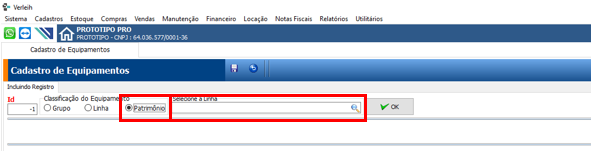<figcaption></figcaption></figure>
  4. Campo “Fornecedor” escolha o Fornecedor do equipamento;
  5. Campos “Compra” informe o número da NF, Data da Compra, Valor da Compra;
  6. Campos “Características” informe a Série, Marca e Modelo do equipamento;
  7.

      <figure>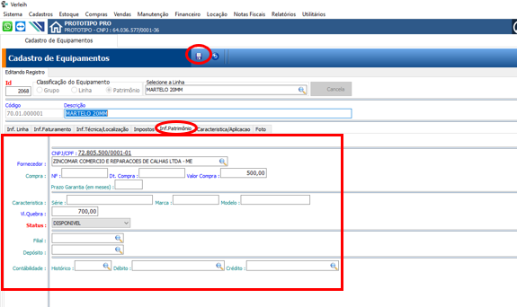<figcaption></figcaption></figure>

***

## Como Editar Grupo Para Equipamentos

*   Passo 1:

    1 - Ir em “Cadastro” – “Equipamentos” – “Equipamentos

    <figure>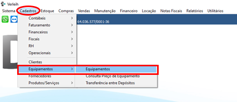<figcaption></figcaption></figure>
*   Passo 2:

    1 - Selecionar o Grupo que deseja edita.\
    2 - Clique no lápis.

    <figure>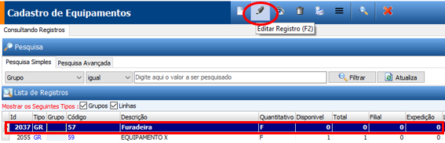<figcaption></figcaption></figure>
*   Passo 3:

    1 - Corrija o que deseja.\
    2 - Clique em gravar.

    <figure>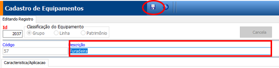<figcaption></figcaption></figure>

***

## Como Remover Grupo

*   Passo 1:

    1 - Ir em “Cadastro” – “Equipamentos” – “Equipamentos

    <figure>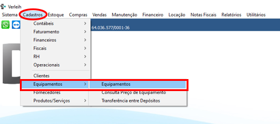<figcaption></figcaption></figure>
*   Passo 2:

    1 - Selecionar o grupo que deseja remover o patrimônio.\
    2 - Clique na lixeira

    <figure>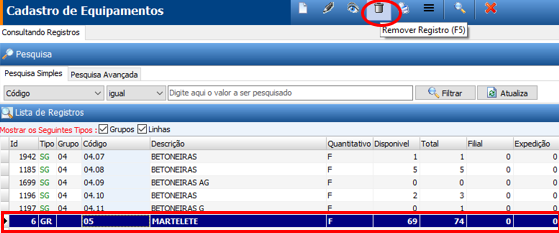<figcaption></figcaption></figure>
*   Passo 3:

    1 - Clique em gravar

    <figure>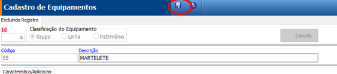<figcaption></figcaption></figure>

***

## Como Editar Linha\subgrupo

*   Passo 1:

    Ir em “Cadastro” – “Equipamentos” – “Equipamentos

    <figure><figcaption></figcaption></figure>
*   Passo 2:

    1 - Selecione a linha que deseja editar.\
    2 - Selecione o patrimonio que deseja editar.\
    3 - Clicar no “Iapis”

    <figure>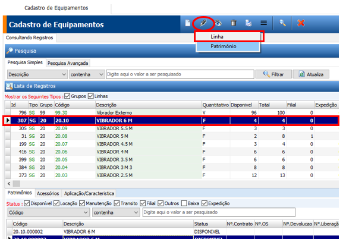<figcaption></figcaption></figure>
*   Passo 3:

    1 - Corrija o que deseja e grave.

    <figure>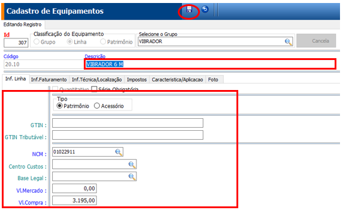<figcaption></figcaption></figure>

***

## Como Remover Linha / Subgrupo

*   Passo 1:

    1 - Ir em “Cadastro” – “Equipamentos” – “Equipamentos

    <figure>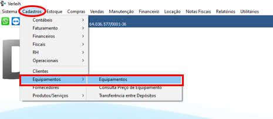<figcaption></figcaption></figure>
*   Passo 2:

    1 - Selecionar a linha que deseja remover o patrimônio.\
    2 - Clique na lixeira

    <figure>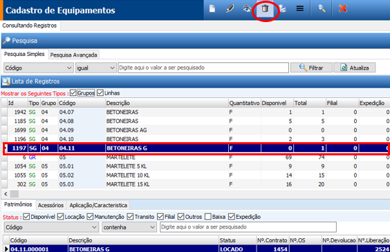<figcaption></figcaption></figure>
*   Passo 3:

    1 - Clique em gravar.

    <figure>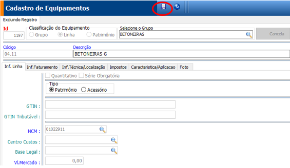<figcaption></figcaption></figure>

***

## Cadastro, Edição e Exclusão de Equipamentos Acessórios

*   Passo 1:

    1 - Ir em “Cadastro” – “Equipamentos” – “Equipamentos”;

    <figure>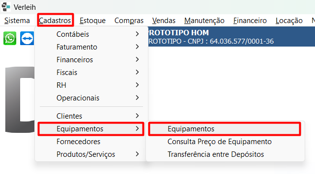<figcaption></figcaption></figure>
*   Passo 2:

    1 – Escolha o subgrupo ou linha ao qual quer indicar os acessórios;\
    2 – Clique no botão “Menu” e escolha a opção “Abrir Cadastro de Equipamentos Acessórios” para ir para tela de movimentação;

    <figure>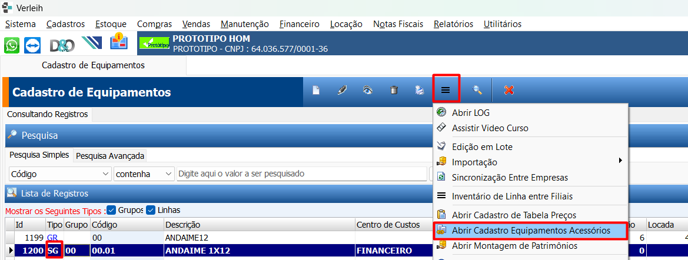<figcaption></figcaption></figure>
*   Passo 3:\
    Inclusão de Equipamentos Acessórios:

    1 - Clicar no botão “Folha em Branco” para iniciar o processo;\
    2 – Escolha o equipamento acessório a incluir;\
    3 – Indique a quantidade exata para cada equipamento a ser locado e, caso esta exatidão não exista, indique o valor “0”;\
    4 – Clique no botão “Gravar”;

    <figure>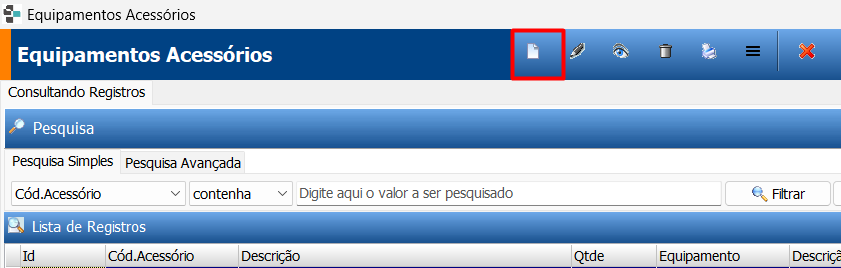<figcaption></figcaption></figure>
*   Passo 4:\
    Edição de Equipamentos Acessórios:

    1 - Clicar no botão “Lápis” para modificar a quantidade de item;\
    2 - Clique no botão “Gravar”;

    <figure>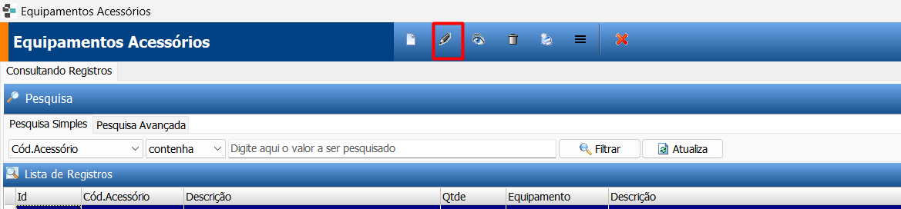<figcaption></figcaption></figure>
*   Passo 5:\
    Exclusão de Equipamentos Acessórios:

    1 – Escolha o equipamento que deseja excluir;\
    2 – Clique no botão Remover;\
    3 - Clique no botão “Gravar”;\

    <figure>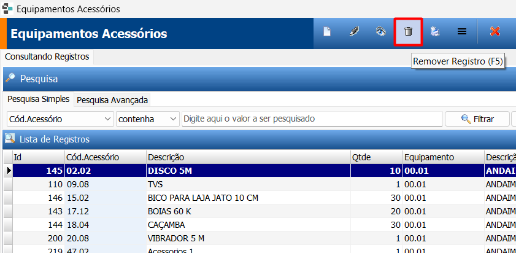<figcaption></figcaption></figure>

***

## Como Editar Patrimonio

*   Passo 1:

    Ir em “Cadastro” – “Equipamentos” – “Equipamentos

    <figure><figcaption></figcaption></figure>
*   Passo 2:

    1 - Selecione a linha que deseja editar.\
    2 - Selecione o patrimonio que deseja editar.\
    3 - Clicar no “Iapis”

    <figure>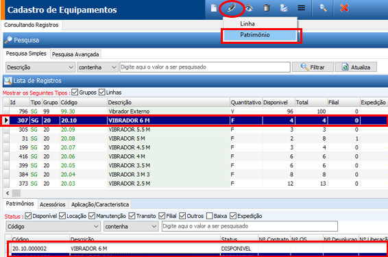<figcaption></figcaption></figure>
*   Passo 3:

    1 - Corrija o que deseja e grave.

    <figure>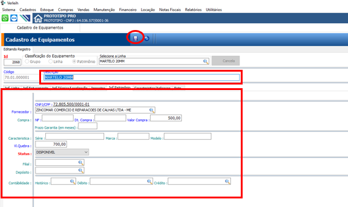<figcaption></figcaption></figure>

***

## Como Remover Patrimonio

*   Passo 1:

    1 - Ir em “Cadastro” – “Equipamentos” – “Equipamentos

    <figure>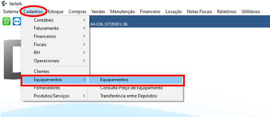<figcaption></figcaption></figure>
*   Passo 2:

    1 - Selecionar a linha que deseja remover o patrimônio.\
    2 - Selecione o patrimônio que deseja remover.\
    3 - Clique na lixeira

    <figure>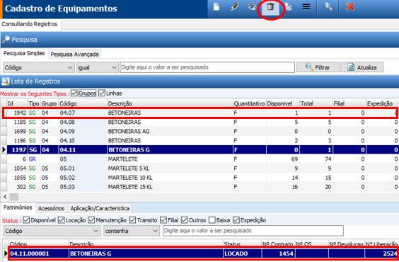<figcaption></figcaption></figure>
*   Passo 3:

    1 - Clique em gravar

<figure>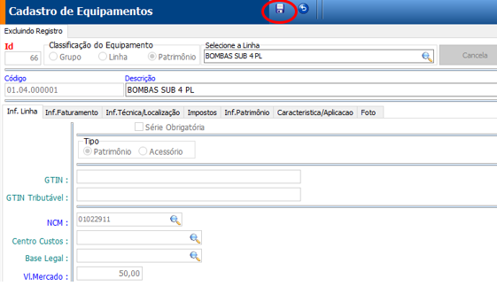<figcaption></figcaption></figure>

***

## Como Editar Acessórios Do Equipamento Principal

*   Passo 1:

    Ir em “Cadastro” – “Equipamentos” – “Equipamentos

    <figure>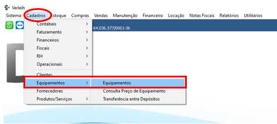<figcaption></figcaption></figure>
*   Passo 2:

    1 - Selecione a linha que que deseja edita acessorios.\
    2 - Clique no botão menu.\
    3 - Abrir cadastro de equipamentos acessorios.

    <figure>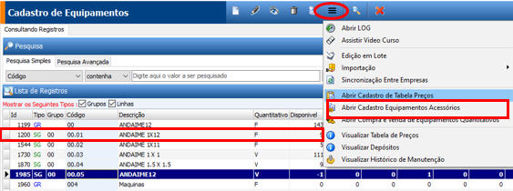<figcaption></figcaption></figure>
*   Passo 3:

    1 - Clique no acessorio que deseja edita.\
    2 - Clique no lapis\
    3 - Corrija o que deseja

    <figure>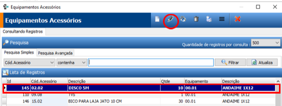<figcaption></figcaption></figure>
*   Passo 4:

    1 - Corrija o que deseja\
    2 - Grave.

    <figure>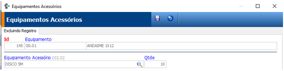<figcaption></figcaption></figure>

***

## Cadastro de Tabela de Preços

A tabela de preços pode ser feita de forma Geral, por Cliente ou Grupo/Família.\
\
Quando tiver condições especial para um grupo de empresas ou um cliente, cadastre uma Família/Grupo e vincule todos os clientes que pertencem ao grupo, então poderá cria tabela para este grupo que terá a preferência ao geral.\
\
Também pode criar tabela específica para um cliente.\

*   Passo 1:

    Ir em “Cadastro” – “Equipamentos” – “Equipamentos

    <figure>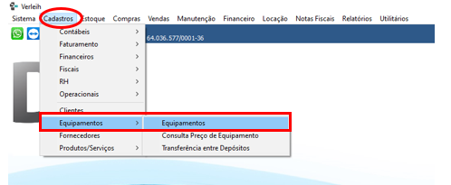<figcaption></figcaption></figure>
*   Passo 2:

    1 - Escolha a linha ou Subgrupo de equipamento que quer cadastrar ou alterar a tabela de preços;

<figure><figcaption></figcaption></figure>

*   Passo 3:

    1 - Clique no Icone “folha branca incluir registro”.

<figure><figcaption></figcaption></figure>

*   Passo 4:

    1. Clique no botão “Menu” e escolha a opção Cadastro de Tabela de Preços;
    2. Clicar no botão “Folha em Branco” para iniciar o processo;
    3. Campo “Unidade” escolha o tipo de unidade padrão para a tabela de preços;
    4. Campo “Período/Quantidade” – indique o período ou quantidade para a tabela de preço;
    5. Campo “Valor Unitário” – Indique o valor unitário para o período escolhido;
    6. Campo “Condições de Pagamento” – indique a condição de pagamento aplicável;
    7. Campo “Data Inicial” vem pré preenchida com a data do computador, alterável quando for o caso;

<figure><figcaption></figcaption></figure>

***

## Como Vincular Acessórios Ao Equipamento Principal

*   Passo 1:

    Ir em “Cadastro” – “Equipamentos” – “Equipamentos

<figure><figcaption></figcaption></figure>

*   Passo 2:

    1 - Selecione a linha que que deseja colocar acessorios.\
    2 - Clique no botão menu.\
    3 - Abrir cadastro de equipamentos acessorios.

<figure><figcaption></figcaption></figure>

*   Passo 3:

    1 - Clique no Icone “folha branca incluir registro”.

<figure><figcaption></figcaption></figure>

*   Passo 4:

    1 - Clique na lupa para buscar item que vai ser o acessorio do principal.\
    2 - Quantidade que vai normalmente para cada equipamento.\
    3 - Gravar.

<figure><figcaption></figcaption></figure>

***

## Como Incluir Quantidades De Equipamentos Quantitativos

*   Passo 1:

    Ir em “Cadastro” – “Equipamentos” – “Equipamentos”;

<figure><figcaption></figcaption></figure>

*   Passo 2:

    1. Escolha o equipamento quantitativo a incluir a Compra/Venda ou Baixa;
    2. Escolha no botão “Menu” Abrir Compra e Venda de Equipamentos Quantitativos;
    3. Clicar no botão “Folha em Branco” para ir para a Tela de Equipamentos Quantitativos;

<figure><figcaption></figcaption></figure>

<figure><figcaption></figcaption></figure>

\

* Passo 3:
  1. Escolha a Operação que deseja entre: Compra, Venda ou Baixa;

<figure><figcaption></figcaption></figure>

\
**Quando a escolha for a Compra:**

1. Indique o Fornecedor;
2. Informe os dados de Data da Compra, Quantidade, Valor Unitário, No. NF e Depósito, se for o caso;

&#x20;

<figure><figcaption></figcaption></figure>

\
**Quando a escolha for a Venda:**

1. Indique o Cliente;
2. Preencha os campos Data da Venda, Quantidade, Valor Unitário, No. Da NF, Depósito, quando for o caso;
3. **Quando a escolha for a Baixa:**
4. Preencha os campos Data da Baixa, Quantidade, Valor Unitário, No. Da NF, Depósito, quando for o caso;\

<figure><figcaption></figcaption></figure>

***

## Como Editar Compra, Venda Ou Baixa De Quantitativo

*   Passo 1:

    Ir em “Cadastro” – “Equipamentos” – “Equipamentos

<figure><figcaption></figcaption></figure>

*   Passo 2:

    1 - Selecione a linha que deseja fazer edição de compra.\
    2 - Clique no botão menu.\
    3 - Abrir compra e venda de equipamento quantitativo.

<figure><figcaption></figcaption></figure>

*   Passo 3:

    1 - selecione a compra, venda ou baixa que deseja editar\
    2 - Clique no lápis

<figure><figcaption></figcaption></figure>

*   Passo 4:

    1 - Corrija o que deseja.\
    2 - Grava.

<figure><figcaption></figcaption></figure>

***

## Como Remover Compra, Venda Ou Baixa De Quantitativo

*   Passo 1:

    Ir em “Cadastro” – “Equipamentos” – “Equipamentos

<figure><figcaption></figcaption></figure>

*   Passo 2:

    1 - Selecione a linha que deseja fazer edição de compra.\
    2 - Clique no botão menu.\
    3 - Abrir compra e venda de equipamento quantitativo.

<figure><figcaption></figcaption></figure>

*   Passo 3:

    1 - selecione a compra, venda ou baixa que deseja remover.\
    2 - Clique na lixeira.

<figure><figcaption></figcaption></figure>

*   Passo 4:

    1 - Corrija o que deseja.\
    2 - Grava.

<figure><figcaption></figcaption></figure>

***

## Como Imprimir Relatorios

*   Passo 1:

    Ir em “Cadastro” – “Equipamentos” – “Equipamentos

<figure><figcaption></figcaption></figure>

*   Passo 2:

    1 - Selecione os dados que precisa fazer a impressao fazendo um filtro.

<figure><figcaption></figcaption></figure>

*   Passo 3:

    1 - Escolha o relatorio que melhor te atende.\
    2 - Clique no relatorios.\
    3 - Clique na impressora.

<figure><figcaption></figcaption></figure>

***

## Como Dar Baixa Patrimônio

*   Passo 1:

    Ir em “Cadastro” – “Equipamentos” – “Equipamentos

<figure><figcaption></figcaption></figure>

*   Passo 2:

    1 - Selecione a linha e patrimonio que deseja da baixa. 2 - Selecione o patrimonio que deseja baixar. 3 - Clicar no “Iapis”

<figure><figcaption></figcaption></figure>

*   Passo 3:

    1 - Mude o status de disponivel para Baixa 2 - Grava

<figure><figcaption></figcaption></figure>

## Como Fazer Uma Edição Em Lote

{== (OBS: muito cuidado com esta ferramenta, precisa fazer um filtro bem feito, do que deseja alterar, se não fizer, vai alterar todo seu cadastro). ==}

*   Passo 1:

    Ir em “Cadastro” – “Equipamentos” – “Equipamentos

<figure><figcaption></figcaption></figure>

*   Passo 2:

    1 - Selecione os dados que precisa fazer a edição em lote fazendo um filtro.\
    2 - Clique no botão menu.\
    3 - Edição em lote.

<figure><figcaption></figcaption></figure>

*   Passo 3:

    1 - Selecione o item que deseja alterar.\
    2 - Coloque o que deseja alterar.\
    3 - Clique em Gravar.

<figure><figcaption></figcaption></figure>

***

## Como Remover Acessorios Do Equipamento Principal

*   Passo 1:

    Ir em “Cadastro” – “Equipamentos” – “Equipamentos

<figure><figcaption></figcaption></figure>

*   Passo 2:

    1 - Selecione a linha que que deseja remover acessorios.\
    2 - Clique no botão menu.\
    3 - Abrir cadastro de equipamentos acessorios.

<figure><figcaption></figcaption></figure>

*   Passo 3:

    1 - Clique no acessorio que deseja remover.\
    2 - Clique na lixeira.

<figure><figcaption></figcaption></figure>

*   Passo 4:

    1 - Grave.

<figure><figcaption></figcaption></figure>

***

## Inventário de Linha Entre Filiais

*   Passo 1:

    1 - Ir em “Cadastro” – “Equipamentos” – “Equipamentos”;

<figure><figcaption></figcaption></figure>

*   Passo 2:

    1 – Clique no botão “Menu”;\
    2 – Escolha o item “Inventário de Linhas Entre Filiais”;

<figure><figcaption></figcaption></figure>

\
&#x20;3 – O sistema iniciará o processo que mostrará qual o status que cada equipamento está em todas as filiais com a opção de alteração para colocar o status correto, quando em desacorda em cada filial;

***
