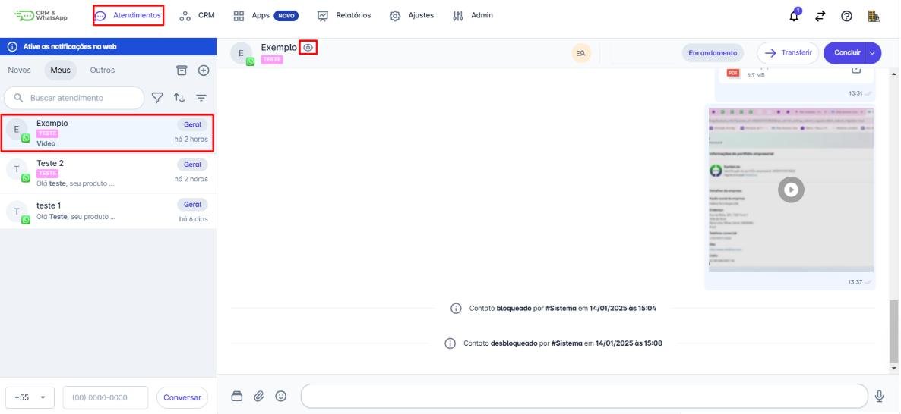

# Liberação

***

## Como Liberar Equipamentos

Passo 1:

Locação - Liberação de equipamento.

<figure><figcaption></figcaption></figure>

Passo 2:

1 - Clique na liberação que deseja escolher os equipamentos.\
2 - Clique no botão Branco.

<figure><figcaption></figcaption></figure>

Passo 3:

1 - Selecione o item a ser liberado no quadradinho em branco (vazio).

<figure><figcaption></figcaption></figure>

Passo 4:

1 - Escolha o patrimônio que vai para a obra\
2 - Confirme.

<figure><figcaption></figcaption></figure>

Passo 5:

1 - Se já escolheu todos que vão para obra clique em gravar.

<figure><figcaption></figcaption></figure>

## Como Emitir NF De Remessa

Passo 1:

Ir em “Locação” – “Controle de contrato”.

<figure><figcaption></figcaption></figure>

Passo 2:

1 - Clique no contrato que deseja emitir a NF.\
2 - Clique no botão NF- NF Remessa.

<figure><figcaption></figcaption></figure>

Passo 3:

1 - Selecione o contrato que deseja emitir NF.\
2 - Clique e emitir NF.

<figure><figcaption></figcaption></figure>

## Como Liberar Equipamentos

Passo 1:

Locação - Liberação de equipamento.

<figure><figcaption></figcaption></figure>

Passo 2:

1 - Clique na liberação que deseja cancelar pode ser total ou parcial.\
2 - Clique em concluído.\
3 - Para localizar o que deseja cancelar clique na quinta coluna (NÚMERO).\
4 - Digite o número do contrato ou da troca.\
5 - Clique no botão Lixeira.

<figure><figcaption></figcaption></figure>

Passo 3:

1 - Selecione o item a ser cancelado no quadradinho em branco (vazio).

<figure><figcaption></figcaption></figure>
